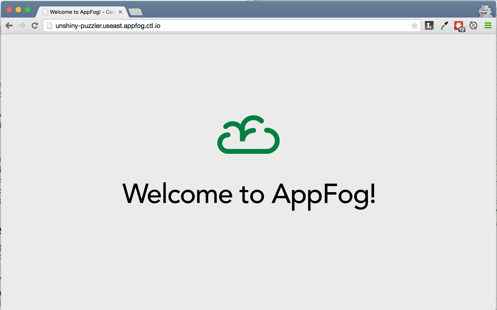

# AppFog Static Website Jumpstart

## Introduction

The AppFog Static Website Jumpstart is a sample application that can be used to get started quickly with a new static website on AppFog.

## Getting Started

To get started, copy the contents of this repo to a new source code repository that you have edit privileges to. Clone that repository and [login to AppFog](https://www.centurylinkcloud.com/knowledge-base/appfog/login-using-cf-cli/). To deploy the application, run the following from the top-level project directory:

```
$ cf push
```

Since the manifest.yml file sets the name of the application to `${random-word}`, the name of the application will be generated during the deployment process. Here is example output of the application deployment using `cf push`:

```
Using manifest file /Users/demo/projects/af-static-jumpstart/manifest.yml

Creating app unshiny-puzzler in org DEMO / space Dev as demouser...
OK

Creating route unshiny-puzzler.useast.appfog.ctl.io...
OK

Binding unshiny-puzzler.useast.appfog.ctl.io to unshiny-puzzler...
OK

Uploading unshiny-puzzler...
...
-----> Uploading droplet (3.3M)

1 of 1 instances running

App started

OK

App unshiny-puzzler was started using this command `sh boot.sh`

Showing health and status for app unshiny-puzzler in org DEMO / space Dev as demouser...
OK

requested state: started
instances: 1/1
usage: 32M x 1 instances
urls: unshiny-puzzler.useast.appfog.ctl.io
last uploaded: Mon Jun 8 15:58:19 UTC 2015
stack: cflinuxfs2

     state     since                    cpu    memory        disk         details   
#0   running   2015-06-08 08:58:34 AM   0.0%   4.7M of 32M   8.7M of 1G
```

Once the application is running, copy the value for `urls:`, in the case above `unshiny-puzzler.useast.appfog.ctl.io`, and go to that URL in a browser. You should see a page that looks like:


 